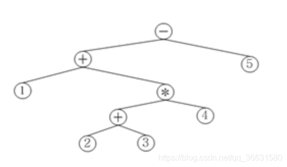
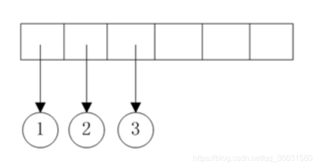
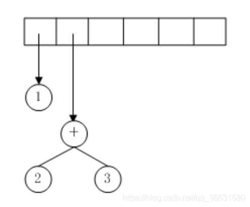
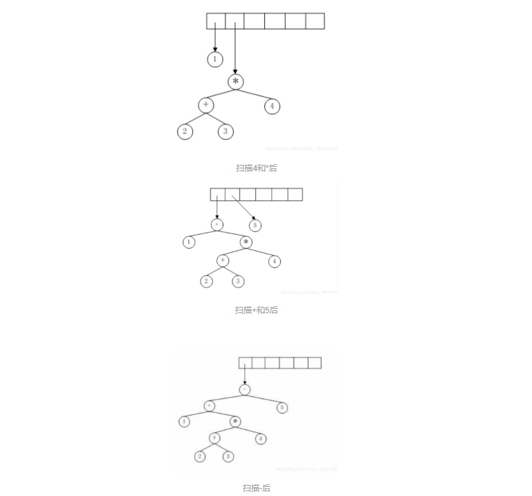

# 前缀、中缀、后缀表达式转换详解

## 1:表达式

### 1.1 、 如有1 + (( 2 + 3)* 4 ) – 5表达式，各个表达式如下

   前缀(运算符在数字前面)：- + 1 * + 2 3 4 5

   中缀(运算符在数字中间)：1 +（（ 2 + 3 ）* 4 ）-5

   后缀(运算符在数字后面)：1 2 3 + 4 * + 5 –

------

## 2:转换方式

### 2.1、中缀表达式转后缀表达式的两种方法

#### 2.1.1 、方法一：直接转换法

​       （1）首先确定表达式表达式A的运算顺序，然后加括号：（（1 + (( 2 + 3)* 4 )） – 5 ）

​       （2）从最里面的一层括号开始运算，转换成后缀表达式的方法为：（忽略括号）数字在前，符号在后。

​         	1） ( 2 + 3) => 23+

 			2)   (( 2 + 3)* 4 ) => 23+4*

 			3) （1 + (( 2 + 3)* 4 )）=> 123+4*+ [按照运算次序，从左到右排列]

​         	4）（（1 + (( 2 + 3)* 4 )） – 5 ）=> 123+4*+ 5-

​         后缀表达式为：1 2 3 + 4 * + 5 –

#### 2.1.2 、方法二：利用表达式树

​             首先将中缀表达式转换为表达式树，然后后序遍历表达式树，所得结果就是后缀表达式。将中缀表达式转化为表 达式树的方法：表达式树             的树叶是操作数，而其他节点为操作符，根结点为优先级最低且靠右的操作符（如上述表达 式优 先级最低是-和+，但-最靠右，所以根为-），圆括          号不包括。如上述表达式的表达式树为：

 

###  2.2、后缀表达式 转 中缀表达式

 假定有后缀表达式1 2 3 + 4 * +5 – ，请将它转化为前缀表达式。

#### 2.2.1、方法一 ：利用表达式树

 从左到右扫面后缀表达式，一次一个符号读入表达式。如果符号是操作数，那么就建立一个单节点树并将它推入 栈中。如果符号是操作符，那么就从栈中弹出两个树T1和T2（T1先弹出）并形成一颗新的树，该树的根就是操作 符，它的左、右儿子分别是T2和T1。然后将指向这棵新树的指针压入栈中。

 

 扫描123后

 前三个符号是操作数，因此创建三颗单节点树并将指向它们的指针压入栈中。

 扫描+后

因此指向最后两颗树的指针被弹出，形成一颗新树，并将指向新树的指针压入栈中。以下的流程图以相同原 理执行。

最后再中序遍历所得的表达式树即得到我们所需的中缀表达式：1+（（2+3）*4）-5

### 2.3 、中缀表达式转为前缀表达式

假定有中缀表达式1 + (( 2 + 3)* 4 ) – 5，请将它转化为前缀表达式。

#### 2.3.1、方法一：直接转换法

（1）首先确定表达式表达式A的运算顺序，然后加括号：（（1 + (( 2 + 3)* 4 )） – 5 ）

（2）从最里面的一层括号开始运算，转换成前缀表达式的方法为：（忽略括号）符号在前，数字在后。

 1）( 2 + 3) => +23

 2) (( 2 + 3)* 4 ) => *+234

 3) （1 + (( 2 + 3)* 4 )）=> +1*+234

 4）（（1 + (( 2 + 3)* 4 )） – 5 ）=> -+1*+2345

 前缀表达式为：- + 1 * + 2 3 4 5

#### 2.3.2、方法二：利用表达式树

 首先将中缀表达式转换为表达式树，然后先序遍历表达式树，所得结果就是前缀表达式。将中缀表达式转化为表达式树的方法：表达式树的树叶是操作数，而其他节点为操作符，根结点为优先级最低且靠右的 操作符（如上述表达式优先级最低是-和+，但-最靠右，所以根为-），圆括号不包括。

 经过前序遍历所得前缀表达式为：- + 1 * + 2 3 4 5

------

## 3:计算方式

### 3.1、前缀表达式计算方式

 要从右至左扫描表达式，首先从右边第一个字符开始判断，若当前字符是数字则一直到数字串的末尾再记录下来，若 为[运算符](https://baike.baidu.com/item/运算符)，则将右边离得最近的两个“数字串”作相应[运算](https://baike.baidu.com/item/运算/5866856)，然后以此作为一个新的“数字串”并记录下来；扫描到表达式 最左端时扫描结束，最后运算的值即为[表达式](https://baike.baidu.com/item/表达式)的值。

 例如：对[前缀表达式](https://baike.baidu.com/item/前缀表达式)“- + 1 * + 2 3 4 5”求值，扫描到5时，记录下这个数字串，扫描到4时，记录下这个数字串，当扫描到+时，当前数字串为"2 3 4 5"，将+右移做相邻两数字串的运算符，记为2+3，结果为5，记录下5这个新数字串为“5 4 5”，然后继续向左扫描，扫描到_时，将_右移做相邻两数字串的运算符5*4 记录下这个数字串“20 5”，扫描到+时当前数字串为“1 20 5”，将+右移做相邻两数字串的运算符，记为1+20，结果为"21 5"，扫描到-时记为21-5，故表达式的值为16。

### 3.2、中缀表达式计算方式

 “1 + (( 2 + 3)* 4 ) – 5” 要从左至右扫描表达式,和人类数学中计算方式一样，计算机中不懂(),+ ,- * ,/等计算优先级，故一般不采用此表达式进行数学计算

### 3.3、后缀表达式计算方式

 要从左至右扫描表达式，首先从左边第一个字符开始判断，若当前字符是数字则一直到数字串的末尾再记录下来，若 为[运算符](https://baike.baidu.com/item/运算符)，则将左边离得最近的两个“数字串”作相应[运算](https://baike.baidu.com/item/运算/5866856)，然后以此作为一个新的“数字串”并记录下来；扫描到表达式 最右端时扫描结束，最后运算的值即为[表达式](https://baike.baidu.com/item/表达式)的值。

 例如：对[后缀表达式](https://baike.baidu.com/item/前缀表达式)“1 2 3 + 4 * +5 – ”求值，扫描到1时，记录下这个数字串，扫描到3时，记录下这个数字串，当扫描到+时，当前数字串为"1 2 3"，将+左移做相邻两数字串的运算符，记为2+3，结果为5，记录下5这个新数字串为“1 5”，然后继续向右扫描，扫描到_时此时数字串“1 5 4”，将_左移做相邻两数字串的运算符5*4 记录下这个数字串“1 20”，扫描到+时当前数字串为“1 20”，将+左移做相邻两数字串的运算符，记为1+20，结果为"21"，扫描到-时此时数字串为“21 5”记为21-5，故表达式的值为16。

https://my.oschina.net/xppba/blog/3188602