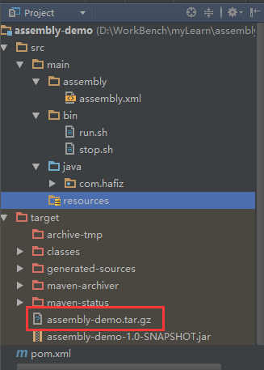
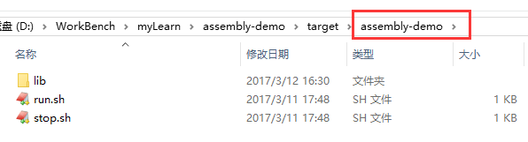

# 使用Maven的assembly插件实现自定义打包

### 一、背景

　　最近我们项目越来越多了，然后我就在想如何才能把基础服务的打包方式统一起来，并且可以实现按照我们的要求来生成，通过研究，我们通过使用maven的assembly插件完美的实现了该需求，爽爆了有木有。本文分享该插件的配置以及微服务的统一打包方式。

### 二、配置步骤及其他事项

1.首先我们需要在pom.xml中配置maven的assembly插件

```xml
<build>
   <plugins>
     <plugin>
       <groupId>org.apache.maven.plugins</groupId>
       <artifactId>maven-jar-plugin</artifactId>
       <version>2.3.1</version>
       <configuration>
         <archive>
           <manifest>
             <!--运行jar包时运行的主类，要求类全名-->
             <mainClass>com.hafiz.Runner</mainClass>
             <!-- 是否指定项目classpath下的依赖 -->
             <addClasspath>true</addClasspath>
            <!-- 指定依赖的时候声明前缀 -->
             <classpathPrefix>./</classpathPrefix>
           </manifest>
         </archive>
       </configuration>
     </plugin>
     <plugin>
       <groupId>org.apache.maven.plugins</groupId>
       <artifactId>maven-assembly-plugin</artifactId>
       <executions>
         <execution><!-- 配置执行器 -->
           <id>make-assembly</id>
           <phase>package</phase><!-- 绑定到package生命周期阶段上 -->
           <goals>
             <goal>single</goal><!-- 只运行一次 -->   
           </goals>
           <configuration>
             <finalName>${project.name}</finalName>
             <descriptor>src/main/assembly/assembly.xml</descriptor><!--配置描述文件路径--> 
           </configuration>
         </execution>
       </executions>
     </plugin>
   </plugins>
</build>
```

2.接着我们在src/main/assembly文件中配置assembly.xml文件

```xml
<assembly>
    <id></id>
    <formats>
        <format>tar.gz</format><!--打包的文件格式,也可以有：war zip-->
    </formats>
    <!--tar.gz压缩包下是否生成和项目名相同的根目录-->
    <includeBaseDirectory>true</includeBaseDirectory>
    <dependencySets>
        <dependencySet>
            <!--是否把本项目添加到依赖文件夹下-->
            <useProjectArtifact>true</useProjectArtifact>
            <outputDirectory>lib</outputDirectory>
            <!--将scope为runtime的依赖包打包-->
            <scope>runtime</scope>
        </dependencySet>
    </dependencySets>
    <fileSets>
        <fileSet>
            <directory>src/main/bin</directory>
            <outputDirectory>/</outputDirectory>
        </fileSet>
    </fileSets>
</assembly>
```

其中，生成的lib文件夹下放该项目的所有依赖以及该服务jar包，src/main/bin文件夹下我们一般放start.sh和stop.sh两个脚本文件用来开启和关闭该服务，打包后直接放到根目录下。生成的tar.gz文件的名字为：[maven-assembly-plugin插件中配置的finalName]-[assembly.xml配置的id(若assembly中没有指定id，则只有前半部分)].

assembly的具体语法，请参见官网：http://maven.apache.org/plugins/maven-assembly-plugin/assembly.html

这里面涉及到如何生成可执行的jar包，具体参见:**[用Maven快速生成带有依赖的可执行jar包](http://www.cnblogs.com/hafiz/p/6538107.html)**

3.项目目录结构



其中红色方框内就是通过assembly插件是生成的tar.gz文件，解压后里面的结构如下：



其中lib目录下是本项目生成的可执行jar包以及它的所有依赖jar包。若assembly插件中配置\<useProjectArtifact>为false，则不会生成assembly-demo文件夹，直接就是lib文件夹以及两个脚本文件。

代码Github地址：**https://github.com/hafizzhang/assembly-demo.git**

4.打包方式思考

我们通过这种方式，每个微服务就是一个以服务名称命名的tar.gz文件，解压后里面lib目录下是该服务生成的可执行jar包以及它所有的依赖jar包，我们直接运行根目录下start.sh和stop.sh两个脚本文件来进行服务的开启和关闭。风格统一，简单明了！

### 三、总结

　　随着微服务的越来越火，我们将服务进行细粒度拆分后，也需要很好的把服务的打包以及部署方式进行统一，这样我们就可以走自动化发布工具来进行统一服务的管理和部署，使得越来越方便。


https://www.cnblogs.com/hafiz/p/6538332.html